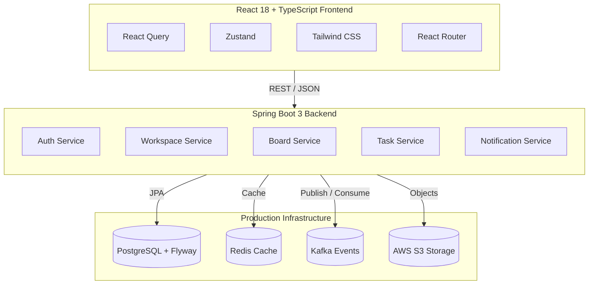

<div align="center">

  

  <br><br>

  <p>
    <strong>Full-stack project management SaaS — built to production standards</strong><br>
    Java Spring Boot 3 &nbsp;·&nbsp; React 18 + TypeScript &nbsp;·&nbsp; PostgreSQL &nbsp;·&nbsp; Redis &nbsp;·&nbsp; Kafka &nbsp;·&nbsp; AWS S3
  </p>

  <p>
    🌐 &nbsp;<a href="https://cod8flow.thecod8r.space"><strong>cod8flow.thecod8r.space</strong></a>
  </p>

  <p>
    
    
    
    
    
    
  </p>

  <p>
    <a href="#overview">Overview</a> &nbsp;·&nbsp;
    <a href="#getting-started">Getting Started</a> &nbsp;·&nbsp;
    <a href="#api-reference">API Reference</a> &nbsp;·&nbsp;
    <a href="#architecture">Architecture</a> &nbsp;·&nbsp;
    <a href="#roadmap">Roadmap</a>
  </p>

</div>

---

## Overview

**cod8flow** is a full-stack project management SaaS platform built as a real product using production-grade technologies and patterns. The platform delivers workspace organization, boards, tasks, and workflow management with a clean, fast, and reliable user experience.

The stack is deliberately chosen for scalability, maintainability, and operational excellence:

- Stateless JWT authentication with refresh token rotation
- Clean layered architecture with Spring Boot
- Versioned database migrations, distributed caching, event-driven notifications, and cloud object storage
- Strong observability from day one

cod8flow is containerized, CI/CD-enabled, and designed to run reliably in production.

---

## Key Features

- **Workspaces & Boards** — Organize projects and teams hierarchically
- **Task Management** — Full task lifecycle with status workflows, priorities, and rich metadata
- **Secure Authentication** — Email/password registration, login, and refresh token rotation
- **Production-Ready Backend** — Spring Boot 3, PostgreSQL, Flyway, Redis, Kafka, and AWS S3
- **Modern React Frontend** — Fast, type-safe interface built with React 18, TanStack Query, Zustand, and Tailwind
- **Observability & Operations** — Health checks, metrics, structured logging, and monitoring-ready setup
- **Deployment Focused** — Docker Compose for local parity, GitHub Actions CI/CD, and clear production deployment paths

---

## Tech Stack

### Backend
| Category          | Technology                  | Role                                          |
|-------------------|-----------------------------|-----------------------------------------------|
| Language          | Java 21 (LTS)               | High-performance, long-term supported runtime |
| Framework         | Spring Boot 3               | Robust, battle-tested application platform    |
| Security          | Spring Security + JWT       | Stateless auth with token rotation            |
| Persistence       | Spring Data JPA + Hibernate | Reliable ORM and data access                  |
| Primary Database  | PostgreSQL 16               | ACID-compliant relational store               |
| Schema Management | Flyway                      | Safe, version-controlled migrations           |
| Caching           | Redis 7                     | Low-latency caching and session support       |
| Async Messaging   | Apache Kafka                | Event-driven notifications and decoupling     |
| File Storage      | AWS S3                      | Scalable attachment and asset storage         |
| API Layer         | Spring MVC (REST)           | Clean, versioned HTTP interface               |

### Frontend
- **React 18 + TypeScript** — Type-safe component architecture
- **TanStack Query** — Efficient server state management and caching
- **Axios** — Typed HTTP client
- **Tailwind CSS** — Consistent, maintainable design system
- **Zustand** — Lightweight global client state
- **React Router** — Modern client-side navigation

### DevOps & Observability
- Docker + Docker Compose (reproducible environments)
- GitHub Actions (automated CI/CD pipelines)
- Spring Boot Actuator + Prometheus + Grafana (metrics & dashboards)
- Structured logging with Logback

---

## Architecture



The backend follows a clear, maintainable layered architecture:

```
controller → service → repository → entity
             ↑
          dto (request / response)
```

Cross-cutting concerns (security, validation, transactions, error handling) are centralized using Spring best practices.

---

## Project Structure

```
src/main/java/com/cod8flow/
├── config/              # Security, Redis, S3, Kafka, and infrastructure configuration
├── controller/          # REST API controllers
├── service/             # Core business logic and transaction management
├── repository/          # Data access layer (Spring Data JPA)
├── domain/
│   ├── entity/          # JPA entities
│   └── enums/           # Domain enumerations (status, priority, roles, etc.)
├── dto/
│   ├── request/         # Incoming request models with validation
│   └── response/        # Outgoing API response models
├── exception/           # Custom exceptions and global error handling
├── security/            # JWT authentication filter and security configuration
└── util/                # Shared utilities

src/main/resources/
├── db/migration/        # Flyway SQL migrations (V1__, V2__, ...)
└── application.yml      # Environment-aware configuration
```

---

## Getting Started

### Prerequisites
- Java 21 JDK
- Docker Desktop
- Git
- (Maven wrapper included — no separate Maven install required)

### Clone and start

```bash
git clone https://github.com/pratik20gb/cod8flow.git
cd cod8flow
```

Start the supporting services:

```bash
docker compose up -d
```

Run the application:

```bash
./mvnw spring-boot:run
```

The API is available at `http://localhost:8080`

### Health check

```bash
curl http://localhost:8080/api/v1/health
```

```json
{
  "status": "UP",
  "service": "cod8flow API",
  "version": "1.0.0",
  "timestamp": "..."
}
```

---

## API Reference

### Authentication
| Method | Endpoint                  | Description                                      |
|--------|---------------------------|--------------------------------------------------|
| POST   | `/api/v1/auth/register`   | Create a new account                             |
| POST   | `/api/v1/auth/login`      | Authenticate and receive access + refresh tokens |
| POST   | `/api/v1/auth/refresh`    | Obtain a new access token using refresh token    |

All authenticated endpoints require: `Authorization: Bearer <access_token>`

### Workspaces
| Method | Endpoint                    |
|--------|-----------------------------|
| GET    | `/api/v1/workspaces`        |
| POST   | `/api/v1/workspaces`        |
| GET    | `/api/v1/workspaces/{id}`   |
| PUT    | `/api/v1/workspaces/{id}`   |
| DELETE | `/api/v1/workspaces/{id}`   |

### Boards
| Method | Endpoint                                  |
|--------|-------------------------------------------|
| GET    | `/api/v1/workspaces/{workspaceId}/boards` |
| POST   | `/api/v1/workspaces/{workspaceId}/boards` |
| GET    | `/api/v1/boards/{boardId}`                |
| DELETE | `/api/v1/boards/{boardId}`                |

### Tasks
| Method | Endpoint                          |
|--------|-----------------------------------|
| GET    | `/api/v1/boards/{boardId}/tasks`  |
| POST   | `/api/v1/boards/{boardId}/tasks`  |
| GET    | `/api/v1/tasks/{taskId}`          |
| PUT    | `/api/v1/tasks/{taskId}`          |
| PATCH  | `/api/v1/tasks/{taskId}/status`   |
| DELETE | `/api/v1/tasks/{taskId}`          |

### Health & Monitoring
- `GET /api/v1/health`
- `GET /actuator/health`
- `GET /actuator/metrics`
- `GET /actuator/prometheus`

---

## Authentication

- Passwords are hashed with BCrypt before storage
- Login and registration return a short-lived access token (15 min) and a refresh token (7 days)
- The refresh endpoint allows clients to get fresh access tokens without re-authenticating
- All protected routes are guarded by a JWT filter that validates signature and expiration

---

## Docker Services

| Service    | Image                | Port |
|------------|----------------------|------|
| PostgreSQL | `postgres:16-alpine` | 5432 |
| Redis      | `redis:7-alpine`     | 6379 |

---

## Database Migrations

Schema changes are managed exclusively with **Flyway**.

- Migration files live in `src/main/resources/db/migration/`
- Files follow the convention `V{N}__{description}.sql`
- Never modify a migration that has already been applied to any environment

---

## Roadmap

| Phase | Focus                                                       | Status         |
|-------|-------------------------------------------------------------|----------------|
| 1     | Core setup, Docker, Flyway, health endpoints                | ✅ Complete     |
| 2     | Authentication — register, login, refresh token rotation    | ✅ Complete     |
| 3     | Workspaces, Boards, Tasks — full domain implementation      | ✅ Complete     |
| 4     | Redis caching + AWS S3 file & attachment support            | ✅ Complete     |
| 5     | Kafka event bus + notification system                       | ✅ Complete     |
| 6     | Testing suite — unit, integration, API                      | 🚧 In Progress |
| 7     | Production frontend, CI/CD pipeline, monitoring dashboards  | ⏳ Pending      |

---

## Observability

cod8flow is built with production monitoring in mind:

- Spring Boot Actuator exposes health and metrics endpoints
- Prometheus endpoint ready for scraping
- Grafana dashboards for request rates, latency, error rates, and JVM metrics
- Structured Logback logging for easy aggregation

---

## Contributing

Thoughtful contributions are welcome.

- Keep changes focused and well-described
- Follow the existing package layout and coding style
- Run tests and verify the build passes before submitting PRs

---

## License

MIT © Pratik

---

## Built by

**Pratik** — [@pratik20gb](https://github.com/pratik20gb)

cod8flow is our own SaaS product. We design, build, and deploy it using the same standards we expect from production systems.

---

<div align="center">
  <sub>If cod8flow helps your team ship better, a ⭐ on GitHub is always appreciated.</sub>
</div>
